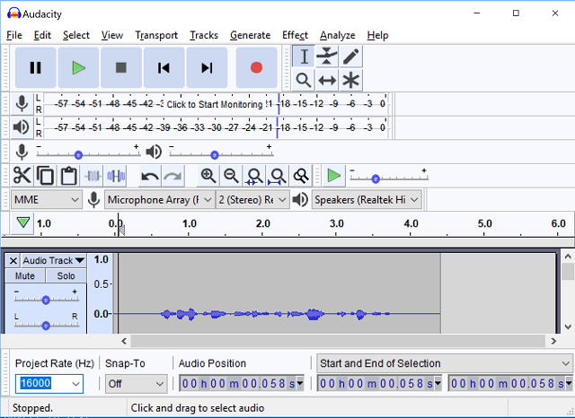

---?image=assets/images/identityimage.jpg&opacity=40

@title[Getting started with Azure Cognitive Services]

### Getting Started
### with Azure Cognitive
### Services

#### @color[#1dafde](Darren 'Doc' Robinson)
#### Principal Identity Management Consultant, Managing Consultant, Microsoft MVP
#### @color[#1dafde](Kloud Solutions)
@snap[south-east]
@size[0.45em](@fa[wordpress] [blog.darrenjrobinson.com](https://blog.darrenjrobinson.com))
@fa[twitter] [@darrenjrobinson](https://twitter.com/darrenjrobinson)
@fa[github] [github.com/darrenjrobinson](https://github.com/darrenjrobinson/MIM-VoiceAssistant)
@snapend

---?image=assets/images/identityimage.jpg&opacity=40

## @size[0.45em](A demonstration of my Voice Assistant for MIM)

---?image=assets/images/identityimage.jpg&opacity=40

@title[Common themes]

### Azure Cognitive Services
@ul
- each Azure Cognitive Service has it's own API
- each has a separate API Key
- no two work the same
- They cover
@ul
- Speech 
- Vision
- Language
- Knowledge
- Search
@ulend 
@ulend

---?image=assets/images/identityimage.jpg&opacity=40

@title[Speech to Text]

### Azure Cognitive Services STT
@ul
- Speech to Text
@ul
- up to 15 seconds can be converted using the RestAPI
- longer conversion using the SDK
- Arabic (Egypt), Italian, German, Japanese, English, Portuguese, Spanish, Russian, French, Chinese
@ulend
@ulend

@title[Convert Audio to Text]
---?gist=darrenjrobinson/fa763b14789f7fd8273dbb4be675bdfa&lang=PowerShell&color=slategrey&title=Speech to Text w/ PowerShell

@[1-4](Read in the Audio File)
@[5-14](Setup API call)
@[15-18](Convert)

---?image=assets/images/identityimage.jpg&opacity=40

@title[Speech to Text Demo]
### @color[orange](Speech to Text Demo)

---?image=assets/images/identityimage.jpg&opacity=40

@title[Text to Speech]

### Azure Cognitive Services TTS
@ul
- Text to Speech
@ul
- a little more involved that STT
- Language options
- Voice Options
- Audio Options
@ulend
@ulend

@title[Text to Speech]
---?gist=darrenjrobinson/a203b820dbe359499d58bcec3e2a5abd&lang=PowerShell&color=slategrey&title=Text to Speech w/ PowerShell
@[1-9](Setup & Get oAuth Token)
@[11-17](Setup Output Settings)
@[19-26](Setup Conversion API Call)
@[43-49](Audio/Voice Settings)
@[51-56](Conversion Text and Convert)
@[59-65](Playback)

---?image=assets/images/identityimage.jpg&opacity=40
@title[Text to Audio Conversion Demo]
### @color[orange](Text to Speech Demo)

---?image=assets/images/identityimage.jpg&opacity=40
@title[LUIS]

### Azure Cognitive Services - LUIS
@ul
- Language Understanding Intelligent Service
@ul
- Taking 'Natural Language' and using ML to understand 'intent' 
- Use common models (e.g Booking Flights, Ordering Pizza)
- or build your own
@ul
- which is what I've done for my solution
@ulend
@ulend
@ulend

---?image=assets/images/identityimage.jpg&opacity=40
@title[LUIS Model]
### @color[orange](Overview of my LUIS Model)

[LUIS Portal - luis.ai](https://www.luis.ai/home)

@title[LUIS with PowerShell]
---?gist=darrenjrobinson/562e1311c96d6eb635ab7ceb163faa09&lang=PowerShell&color=slategrey&title=Intent from Natural Language w/ PowerShell
@[1-6](Setup)
@[9-11](Query)
@[15-17](Response)

---?image=assets/images/identityimage.jpg&opacity=40
@title[Language Translation]

#### Azure Cognitive Services Text Translator
@ul
- Neural Machine Translation Service
- 60 Languages including Samoan and Klingon
@ulend

@title[Text Language Conversion with PowerShell]
---?gist=darrenjrobinson/0930c83c7bb8279daa92a6bff3e60b6a&lang=PowerShell&color=slategrey&title=Language Text Translation w/ PowerShell
@[1-4](Setup)
@[6-9](from - to languages)
@[11-15](API and Headers)
@[17-20](Text to convert)
@[22-23](Conversion)

---?image=assets/images/identityimage.jpg&opacity=40
@title[Text Language Translation Demo]
### @color[orange](Text Language Translation Demo)

---?image=assets/images/identityimage.jpg&opacity=40

@title[Built With IoT]
#### @color[orange](How did I build the Voice Assistant for Microsoft Identity Manager?)
@ul 
Built with an IoT Device
@ul
- OpenWRT on Seeed Studio Respeaker Core 1.0
- Python 2.7
@ulend
@ulend

---?image=assets/images/identityimage.jpg&opacity=40

@title[Built With Azure Services]
#### @color[orange](Built with Azure Services)
@ul
- IoT Device & IoT Hub
- IoT Event Hub
- Azure Functions
- PowerShell
- Managed Service Identity
- Azure Key Vault
- Azure API Management
- Azure Table Storage
- Power BI
@ulend

---?image=assets/images/identityimage.jpg&opacity=40

@title[Built With Azure Congnitive Services]
#### @color[orange](Built with Azure Cognitive Services)
@ul
- Speech to Text
- Language Understanding Intelligent Service LUIS
- Text to Speech
@ulend

---?image=assets/images/identityimage.jpg&opacity=40

@title[Built With MIM]
#### @color[orange](Built with Microsoft Identity Manager)
@ul
- Microsoft Identity Manager 2016 SP1
- Lithnet MIM Service REST API
@ulend

---?image=assets/images/Architecture.png&position=right&size=55% 100%&color=#ffffff
@title[Architecture 1]
@snap[west commentary]
The IT Support Staff member speaks to the Voice Assistant
@snapend

---?image=assets/images/Architecture.png&position=right&size=55% 100%&color=#ffffff
@title[Architecture 2]
@snap[west commentary]
The Voice Assistant takes the spoken request and submits it to Azure Cognitive Services to convert the request from speech to text
@snapend

---?image=assets/images/Architecture.png&position=right&size=55% 100%&color=#ffffff
@title[Architecture 3]
@snap[west commentary-verbose]
The Voice Assistant then submits the request to an Azure Function that takes the request and sends it to Language Understanding Intelligent Service which identifies the Entity e.g. 'User' and Entitlement e.g 'Mailbox' and returns it to the Function which then queries Microsoft Identity Manager for the Entity and returns the record to the Function which identifies the value for the entitlement and generates the response text which is returned to the Voice Assistant
@snapend

---?image=assets/images/Architecture.png&position=right&size=55% 100%&color=#ffffff
@title[Architecture 4]
@snap[west commentary]
The Voice Assistant takes the response text and submits it to Azure Cognitive Services 'Text to Speech' to turn the response into audio
@snapend

---?image=assets/images/Architecture.png&position=right&size=55% 100%&color=#ffffff
@title[Architecture 5]
@snap[west commentary]
The Voice Assistant speaks the response to the IT Support Staff Member
@snapend  

---?image=assets/images/Architecture.png&position=right&size=55% 100%&color=#ffffff
@title[Architecture 6]
@snap[west commentary]
The Voice Assistant sends a summary of the interaction to IoT Hub which sends it to Stream Analytics and logs it to Azure Table Storage as well as sending it to Power BI which displays Analytics of the use of the Voice Assistant
@snapend  

---?image=assets/images/Dashboard.jpg&position=right&size=65% 65%&color=#ffffff
@title[Dashboard]
@snap[west commentary commentary-slim]
Analytics from the use of the Voice Assistant
@snapend  

---?color=#000000
@title[End]
### More information
#### @color[orange](Voice Assistant Presentation)
##### https://gitpitch.com/darrenjrobinson/MIM-VoiceAssistant/presentation
@fa[wordpress] blog.darrenjrobinson.com  
@fa[twitter] @darrenjrobinson  
@fa[github] github.com/darrenjrobinson/MIM-VoiceAssistant 

